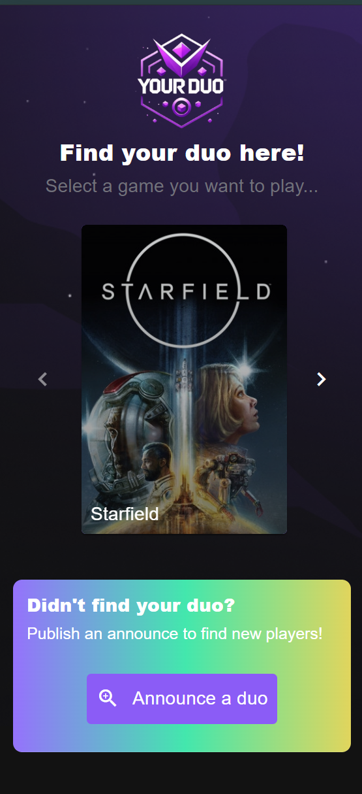
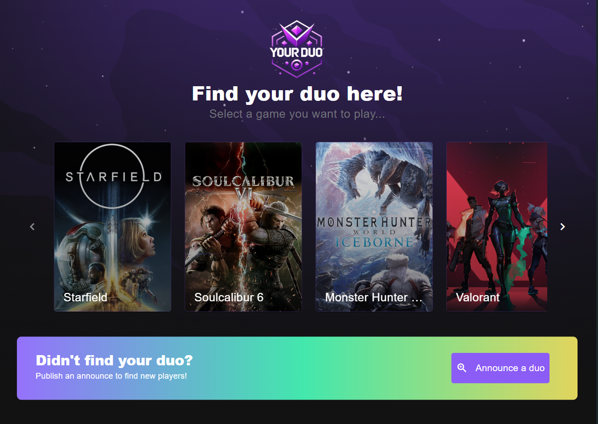
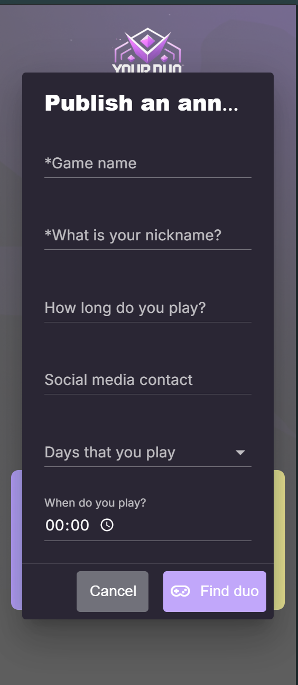
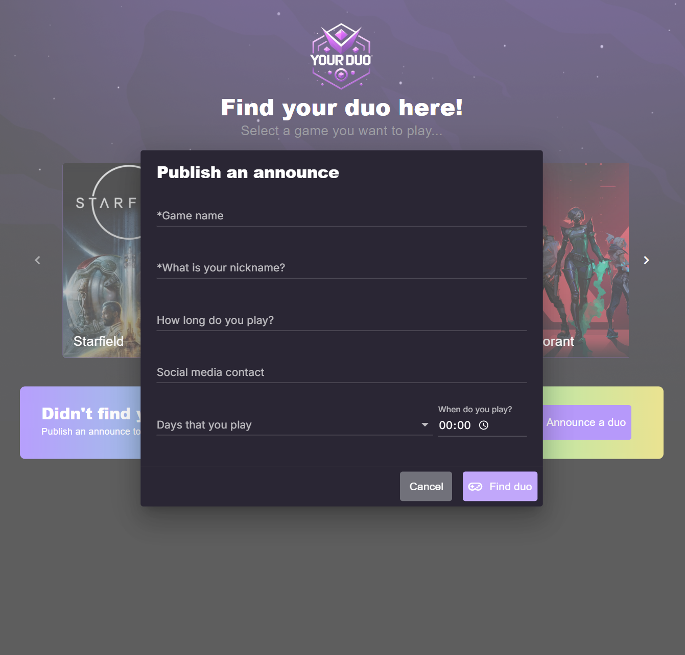

# Your-Duo
Your-Duo é uma aplicação web em Vue desenvolvida para conectar jogadores que compartilham interesses em jogos semelhantes. O objetivo é promover a interação e a formação de equipes, facilitando a comunicação e a conexão entre gamers de diferentes níveis e interesses. A interface é responsiva, e pode ser acessada em qualquer dispositivo.

### home mobile

### home desktop

### form mobile

### form desktop

## Documentação do avanço do projeto

### Componentes

- [x] Logo
- [x] Carousel
- [x] Card
- [x] Button
- [x] Connect message
- [x] Create New Post Button
- [x] Publish Post Form
- [ ] Validate form fields
- [ ] Add a post to list
- [ ] List how much posts have

### Páginas

- [X] Home page
- [ ] Post detail page
- [ ] Profile page

### Testes unitários

- [ ] Logo
  - [ ] Should be created
- [ ] Carousel
  - [ ] Should be created
- [ ] Card
  - [ ] Should be created
- [ ] Button
  - [ ] Should be created
- [ ] Connect message
  - [ ] Should be created
- [ ] Create New Post Button
  - [ ] Should be created
- [ ] Publish Post Form
  - [ ] Should be created
- [ ] Login Form
  - [ ] Should be created

### Test E2E

- [ ] Home page
- [ ] Post detail page
- [ ] Profile page
